# Démonstration Fonctionnelle — Système de Gestion de Tâches Collaboratives

> Ce document présente les fonctionnalités clés de l'application à travers des captures d'écran annotées.

---

## Table des matières

1. [Inscription en 3 étapes](#1-inscription-en-3-étapes)
2. [Validation de compte par l'administrateur](#2-validation-de-compte-par-ladministrateur)
3. [Connexion JWT](#3-connexion-jwt)
4. [Dashboard Administrateur](#4-dashboard-administrateur)
5. [Gestion des utilisateurs](#5-gestion-des-utilisateurs)
6. [Gestion des projets](#6-gestion-des-projets)
7. [Gestion des tâches](#7-gestion-des-tâches)
8. [Chat par projet](#8-chat-par-projet)
9. [Dashboard Professeur](#9-dashboard-professeur)
10. [Dashboard Étudiant](#10-dashboard-étudiant)
11. [Module Primes — Statistiques Professeurs](#11-module-primes--statistiques-professeurs)
12. [Gestion du profil](#12-gestion-du-profil)
13. [Rappels automatiques (Celery)](#13-rappels-automatiques-celery)

---

## 1. Inscription en 3 étapes

### Étape 1 — Informations personnelles (Identité)

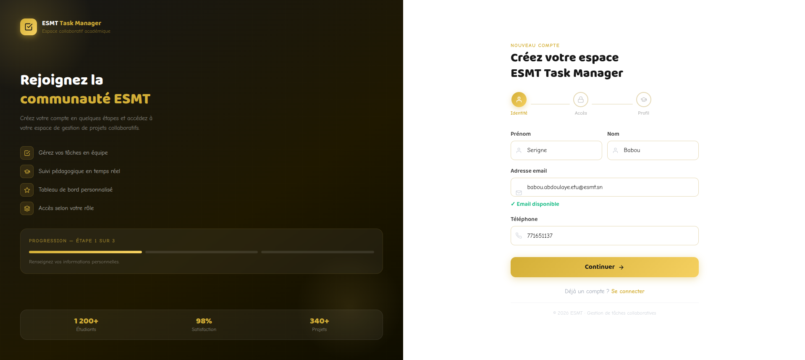

> **Annotation :** L'utilisateur renseigne son prénom, nom, adresse email et téléphone. La vérification de disponibilité de l'email se fait **en temps réel** (indicateur vert "Email disponible"). La progression affiche **Étape 1 sur 3**.

---

### Étape 2 — Mot de passe (Accès)

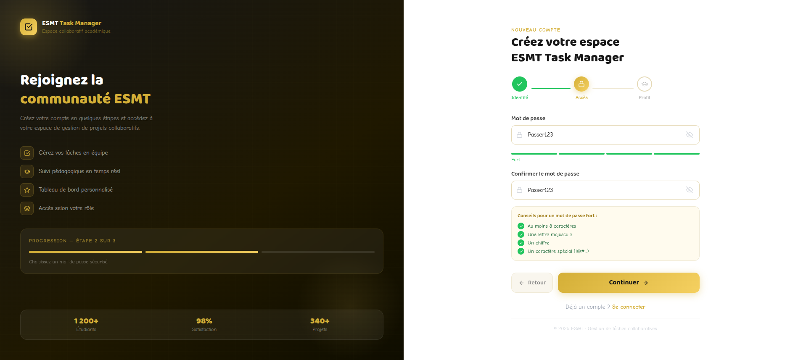

> **Annotation :** L'utilisateur choisit un mot de passe sécurisé. Un indicateur de force en temps réel valide les critères : au moins 8 caractères, une majuscule, un chiffre et un caractère spécial. Tous les critères sont cochés en vert avant de continuer.

---

### Étape 3 — Rôle, Promotion & Photo de profil

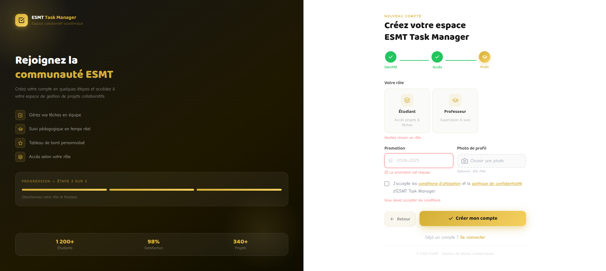

> **Annotation :** L'utilisateur choisit son rôle (**Étudiant** ou **Professeur**), renseigne sa promotion et peut uploader une photo de profil. Les deux premières étapes (Identité et Accès) sont déjà validées (cercles verts). Le compte créé est **inactif** par défaut — il doit être validé par l'administrateur avant de pouvoir se connecter.

---

## 2. Validation de compte par l'administrateur

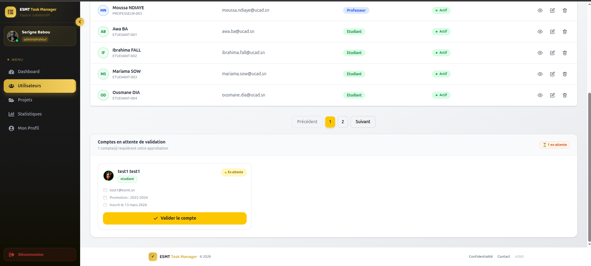

> **Annotation :** La section **"Comptes en attente de validation"** affiche les nouveaux inscrits nécessitant une approbation (ici 1 en attente). L'administrateur voit le nom, le rôle, l'email, la promotion et la date d'inscription. Un clic sur **"Valider le compte"** active l'utilisateur. La liste du haut montre les utilisateurs déjà actifs avec leurs matricules automatiques (`ETUDIANT-001`, `PROFESSEUR-003`, etc.).

---

## 3. Connexion JWT

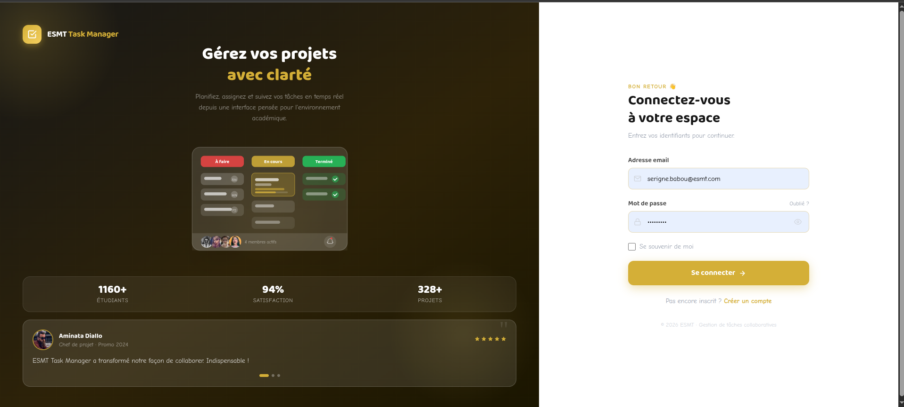

> **Annotation :** Authentification par email et mot de passe. Le panneau gauche présente l'application avec un aperçu visuel du système de tâches et des statistiques (1160+ étudiants, 94% satisfaction). En cas de succès, deux tokens JWT sont générés et l'utilisateur est redirigé automatiquement vers son dashboard selon son rôle.

---

## 4. Dashboard Administrateur

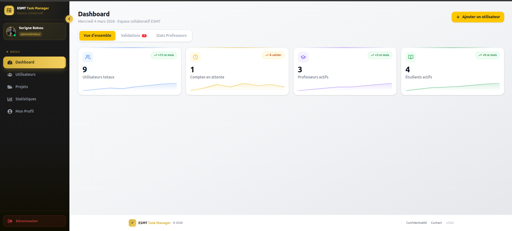

> **Annotation :** Vue d'ensemble du système avec 4 KPIs en temps réel : **9 utilisateurs totaux**, **1 compte en attente**, **3 professeurs actifs**, **4 étudiants actifs** — chacun avec une mini courbe de tendance. Trois onglets permettent de naviguer entre la vue d'ensemble, les validations en attente et les statistiques professeurs. Le bouton **"+ Ajouter un utilisateur"** permet à l'admin de créer un compte directement actif.

---

## 5. Gestion des utilisateurs

### Liste des utilisateurs

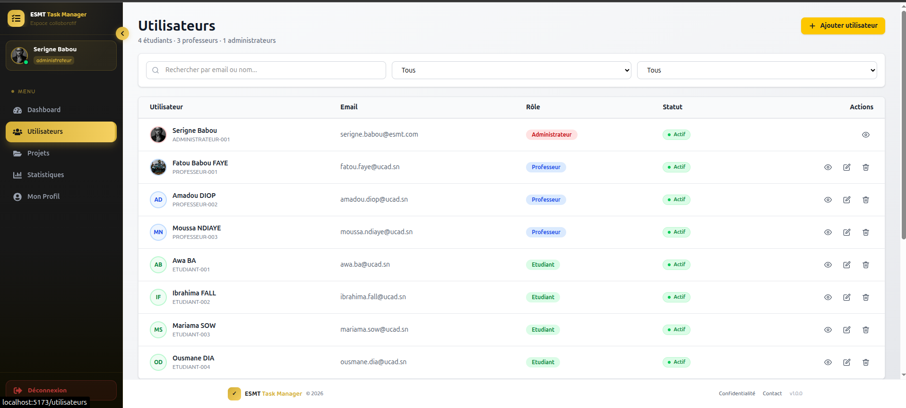

> **Annotation :** L'administrateur voit tous les utilisateurs enregistrés : **4 étudiants, 3 professeurs, 1 administrateur**. Chaque ligne affiche l'avatar, le nom, le matricule auto-généré (`ADMINISTRATEUR-001`, `PROFESSEUR-001`, `ETUDIANT-001`, etc.), l'email, le rôle coloré et le statut. Une barre de recherche et deux filtres (rôle, statut) permettent de trier rapidement. Les actions disponibles : voir, modifier, supprimer.

---

### Création d'un utilisateur par l'admin

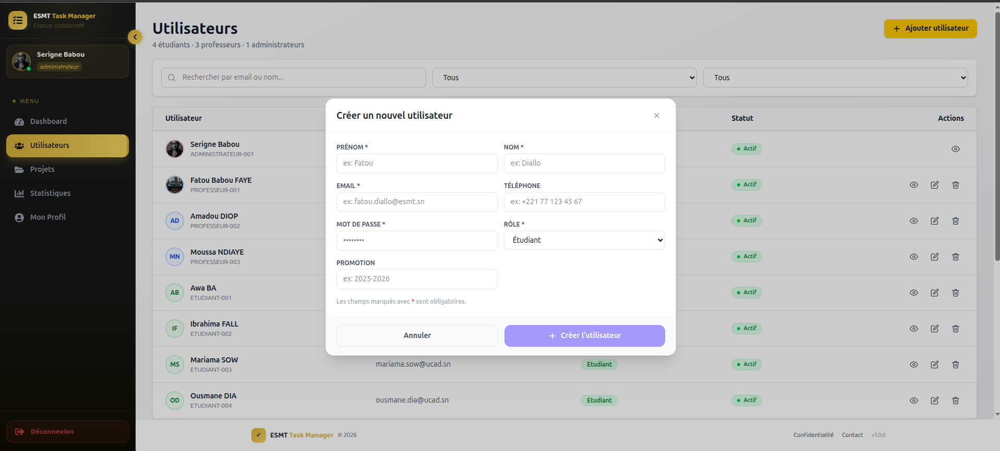

> **Annotation :** Une modale s'ouvre par-dessus la liste. L'admin renseigne prénom, nom, email, téléphone, mot de passe, rôle (Étudiant / Professeur / Administrateur) et promotion. Contrairement à l'inscription publique, le compte créé ici est **directement actif** — aucune validation requise.

---

## 6. Gestion des projets

### Liste des projets

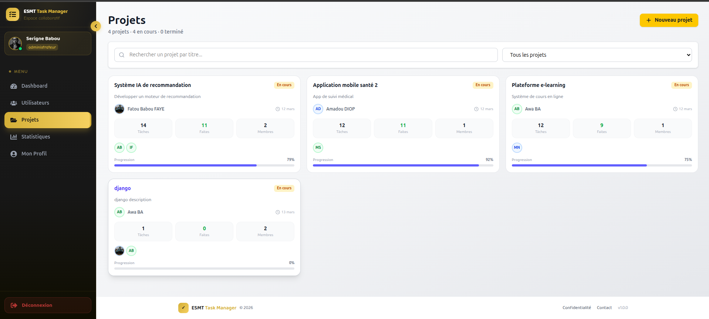

> **Annotation :** Les projets sont affichés en cartes. Chaque carte montre le titre, la description, le créateur, la date, le nombre de tâches/faites/membres, les avatars des collaborateurs et une **barre de progression** calculée automatiquement. Exemples : *Système IA de recommandation* à **79%**, *Application mobile santé 2* à **92%**, *Plateforme e-learning* à **75%**, *django* à **0%** (aucune tâche terminée).

---

### Création d'un projet

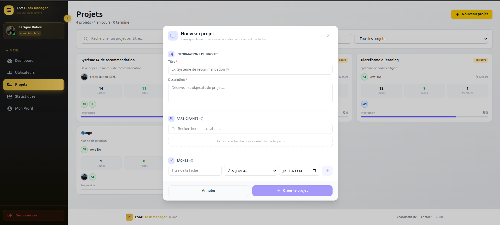

> **Annotation :** La modale de création regroupe tout en une seule étape : **informations du projet** (titre, description), **participants** (recherche et ajout de collaborateurs) et **tâches** (titre, assignation, date d'échéance). Le créateur devient automatiquement responsable du projet.

---

### Ajout de collaborateurs

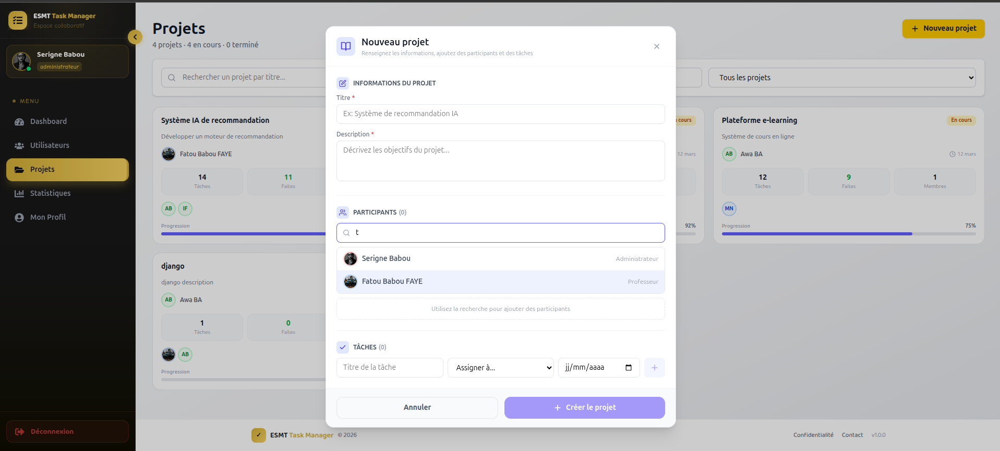

> **Annotation :** La recherche de participants fonctionne **en temps réel** — ici la lettre "t" fait apparaître les utilisateurs correspondants avec leur rôle (Administrateur, Professeur, etc.). Seuls les étudiants et professeurs peuvent être ajoutés comme collaborateurs. Un même utilisateur ne peut être ajouté qu'une seule fois.

---

## 7. Gestion des tâches

### Liste des tâches

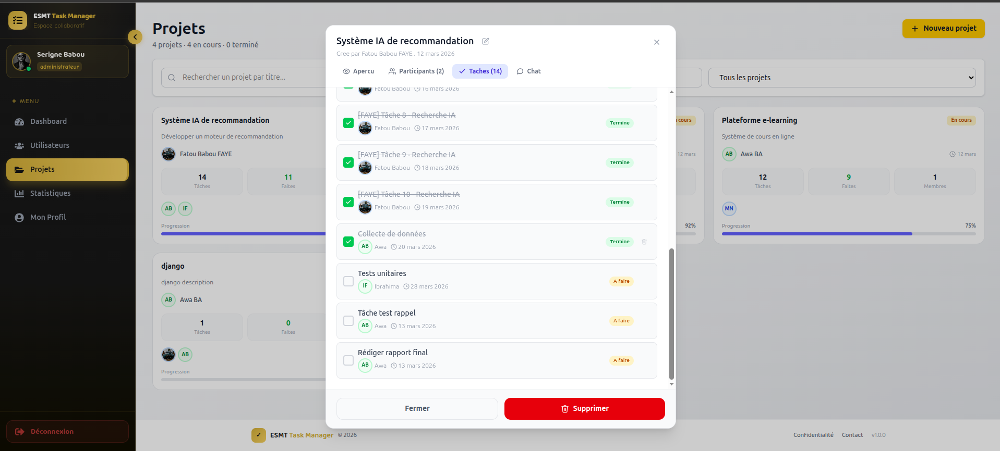

> **Annotation :** Vue des tâches du projet *Système IA de recommandation* (14 tâches au total). Chaque tâche affiche le titre, le collaborateur assigné (avatar + prénom), la date d'échéance et le statut coloré : **Terminé** (vert) ou **À faire** (orange). La case à cocher permet de basculer le statut directement. Le projet dispose aussi d'onglets **Aperçu**, **Participants** et **Chat**.

---

### Création et assignation d'une tâche

<!-- SCREENSHOT : formulaire de création de tâche avec sélection du collaborateur et date d'échéance -->

> **Annotation :** Seul le créateur du projet peut créer des tâches. La tâche est assignée à un collaborateur du projet. Une date d'échéance est obligatoire.

---

### Changement de statut

<!-- SCREENSHOT : tâche avec bouton de changement de statut "À faire" → "Terminé" -->

> **Annotation :** Le collaborateur assigné à une tâche peut la marquer comme terminée. La date de complétion est enregistrée automatiquement — elle sert au calcul des primes professeurs.

---

## 8. Chat par projet

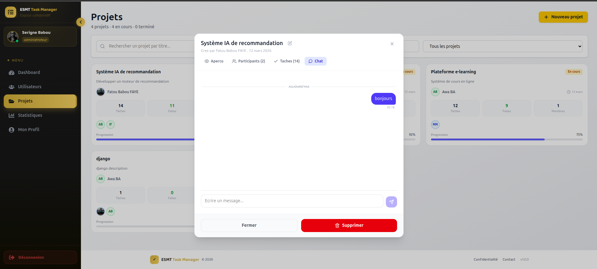

> **Annotation :** Chaque projet dispose d'un onglet **Chat** intégré. Les messages de l'utilisateur connecté s'affichent à droite (bulle violette). Le champ de saisie en bas permet d'envoyer un nouveau message. Les messages sont horodatés et marqués comme lus automatiquement à l'ouverture. Un badge indique le nombre de messages non lus depuis la dernière visite.

---

## 9. Dashboard Professeur

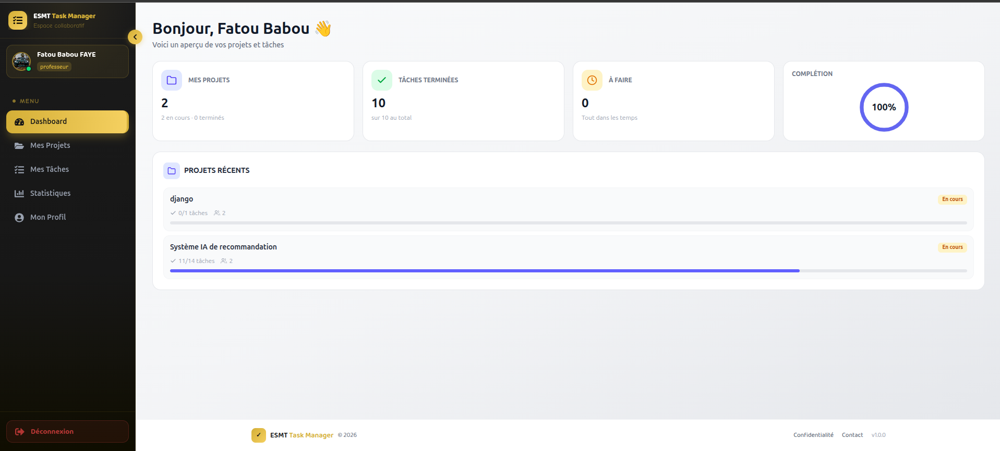

> **Annotation :** Dashboard personnalisé pour le professeur **Fatou Babou FAYE** avec 4 indicateurs clés : **2 projets** en cours, **10 tâches terminées** sur 10, **0 tâche à faire** ("Tout dans les temps"), et un taux de **complétion à 100%** (jauge circulaire). La section "Projets récents" liste les projets avec leur progression (*Système IA de recommandation* à 11/14 tâches).

---

## 10. Dashboard Étudiant

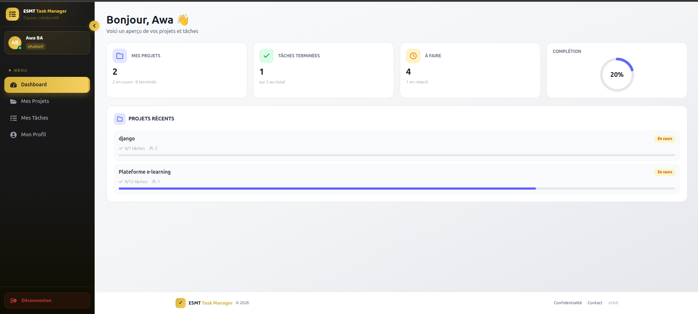

> **Annotation :** Dashboard personnalisé pour l'étudiante **Awa BA** : **2 projets** en cours, **1 tâche terminée** sur 5, **4 tâches à faire** dont 1 en retard, et un taux de **complétion à 20%**. La section "Projets récents" liste les projets avec leur progression (*Plateforme e-learning* à 9/12 tâches). Le menu étudiant est simplifié : Mes Projets, Mes Tâches, Mon Profil — sans accès aux statistiques ni à la gestion.

---

## 11. Module Primes — Statistiques Professeurs

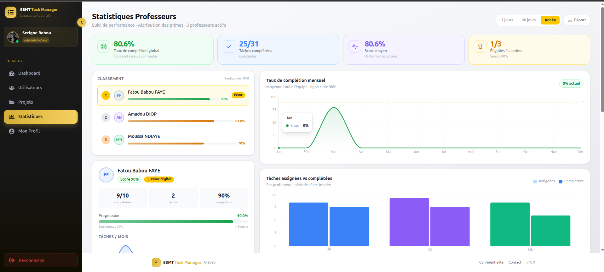

> **Annotation :** Page complète de suivi des performances des professeurs (vue admin) :
>
> - **KPIs globaux** : 80.6% de complétion global, 25/31 tâches complétées, 1/3 professeurs éligibles à la prime (seuil ≥ 90%)
> - **Classement** : Fatou Babou FAYE (90% — **Prime éligible**), Amadou DIOP (81.8%), Moussa NDIAYE (70%)
> - **Détail individuel** : score, tâches complétées, projets actifs, barre de progression vers le seuil de prime
> - **Graphiques** : taux de complétion mensuel (courbe) et tâches assignées vs complétées par professeur (barres)
> - **Filtre temporel** : 7 jours / 30 jours / Année + bouton Export

---

## 12. Gestion du profil

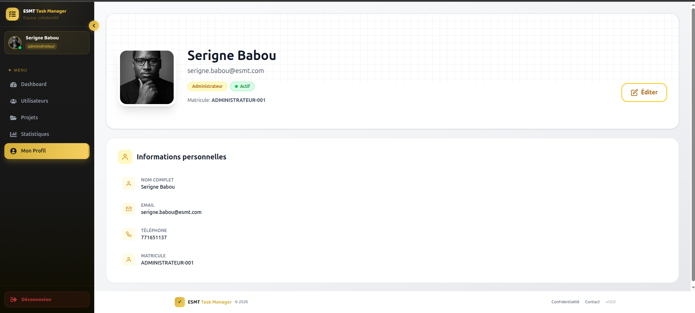

> **Annotation :** Page profil commune à tous les rôles. Elle affiche la photo, le nom, l'email, le rôle, le statut et le matricule (`ADMINISTRATEUR-001`). La section "Informations personnelles" détaille le nom complet, email, téléphone et matricule (en lecture seule). Le bouton **"Éditer"** permet de modifier les informations et la photo de profil.

---

## Résumé des rôles

| Fonctionnalité | Administrateur | Professeur | Étudiant |
|---|:---:|:---:|:---:|
| Valider les comptes | ✓ | - | - |
| Gérer tous les utilisateurs | ✓ | - | - |
| Voir tous les projets | ✓ | - | - |
| Créer un projet | ✓ | ✓ | ✓ |
| Ajouter des collaborateurs | ✓ | ✓ (si créateur) | ✓ (si créateur) |
| Créer des tâches | ✓ | ✓ (si créateur) | ✓ (si créateur) |
| Modifier le statut d'une tâche | ✓ | ✓ (si assigné) | ✓ (si assigné) |
| Chat par projet | ✓ | ✓ | ✓ |
| Voir les statistiques professeurs | ✓ | ✓ (ses stats) | - |
| Calculer les primes | ✓ | - | - |

---

## 13. Rappels automatiques (Celery)

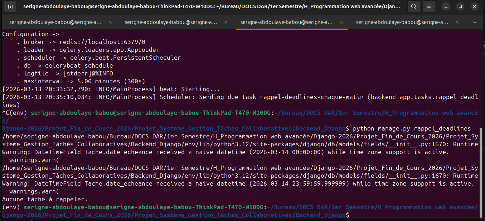

> **Annotation :** Le système utilise **Celery Beat** comme planificateur de tâches de fond. La commande `python manage.py rappel_deadlines` est exécutée automatiquement chaque jour à une heure configurée. Elle détecte les tâches dont la deadline est le lendemain et envoie un email de rappel à chaque assigné. Ici, le message **"Aucune tâche à rappeler."** indique qu'aucune tâche n'est due demain — le système a bien tourné sans erreur. En production, les emails sont envoyés via SMTP sans intervention manuelle.
